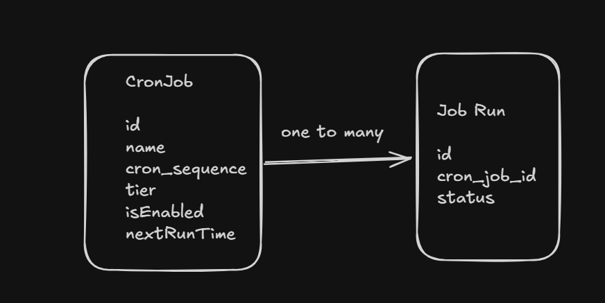
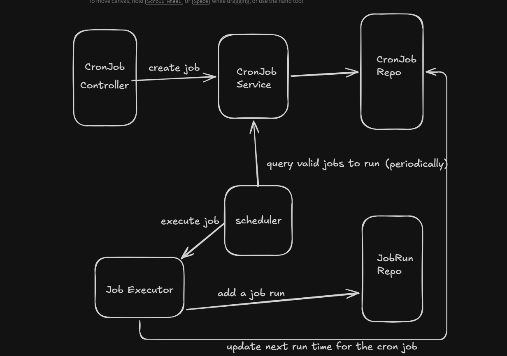

# Job Scheduler

A robust, Spring Boot-based cron job scheduler with priority-based execution tiers and full audit trail support.

## Overview

Job Scheduler is a distributed cron job management system that allows you to create, manage, and monitor scheduled jobs with different precision levels. Each job execution is tracked and persisted, enabling complete audit trails even after job deletion.

## Key Features

- **Priority-Based Scheduling**: HIGH (1s), MEDIUM (5s), LOW (1m) execution tiers
- **Full CRUD APIs**: Create, read, update, and delete cron jobs
- **Runtime Updates**: Modify jobs anytime without restarting
- **Audit Trail**: All job runs persisted, orphan runs kept for deleted jobs

## Architecture





## API Reference

### Create Cron Job

```http
POST /api/cron-jobs
Content-Type: application/json

{
  "name": "Backup Database",
  "cronExpression": "0 0 2 * * ?",
  "tier": "MEDIUM",
  "isEnabled": true
}
```

**Response:**
```json
{
  "id": "uuid",
  "name": "Backup Database",
  "cronExpression": "0 0 2 * * ?",
  "tier": "MEDIUM",
  "isEnabled": true,
  "nextRunTime": "2026-07-25T02:00:00"
}
```

### Get All Cron Jobs

```http
GET /api/cron-jobs
```

### Update Cron Job (PATCH)

```http
PATCH /api/cron-jobs/{id}
Content-Type: application/json

{
  "cronExpression": "0 0 3 * * ?",
  "isEnabled": false
}
```

### Delete Cron Job

```http
DELETE /api/cron-jobs/{id}
```
*Note: Job runs are NOT deleted, only orphaned (cron_job_id becomes NULL)*

### Get Job Runs for a Cron Job

```http
GET /api/cron-jobs/{jobId}/runs
```

**Response:**
```json
[
  {
    "id": "run-uuid",
    "jobId": "job-uuid",
    "jobName": "Backup Database",
    "status": "SUCCESS",
    "startedAt": "2026-07-24T02:00:01",
    "finishedAt": "2026-07-24T02:15:32",
    "durationMs": 911000,
    "errorMessage": null
  }
]
```

### List Orphan Runs

```http
GET /api/job-runs/orphaned
```

Returns all job runs whose associated cron job has been deleted. Perfect for audit purposes.

## Data Model

### CronJob Entity
```java
{
  id: UUID,
  name: String,
  cronExpression: String,              // Quartz cron format
  tier: SchedulingPrecision,           // HIGH, MEDIUM, LOW
  isEnabled: Boolean,
  nextRunTime: LocalDateTime,
  createdAt: LocalDateTime
}
```

### JobRun Entity
```java
{
  id: UUID,
  cronJobId: String (nullable),        // NULL for orphan runs
  status: JobRunStatus,                // SUCCESS, FAILED, etc.
  startedAt: LocalDateTime,
  finishedAt: LocalDateTime,
  durationMs: Long,
  errorMessage: String (optional),
  createdAt: LocalDateTime
}
```

## Getting Started

### Prerequisites
- Java 17+
- Spring Boot 3.x
- MySQL/PostgreSQL
- Maven

### Build & Run

```bash
mvn clean install
mvn spring-boot:run
```

### Configuration

Set these properties in `application.properties`:

```properties
spring.datasource.url=jdbc:mysql://localhost:3306/job_scheduler
spring.datasource.username=root
spring.datasource.password=password
spring.jpa.hibernate.ddl-auto=update
```

## Audit & Compliance

The system maintains a complete audit trail:
- Every job execution is recorded in `job_runs` table
- Deleted jobs' execution history is preserved (orphan runs)
- All timestamps are captured (createdAt, startedAt, finishedAt)
- Job modifications are version-tracked

## Use Cases

1. **Database Backups** → HIGH tier, runs hourly
2. **Email Notifications** → MEDIUM tier, runs every 5 minutes
3. **Log Cleanup** → LOW tier, runs daily
4. **Payment Processing** → HIGH tier, runs every minute
5. **Report Generation** → LOW tier, runs weekly

## License

MIT
